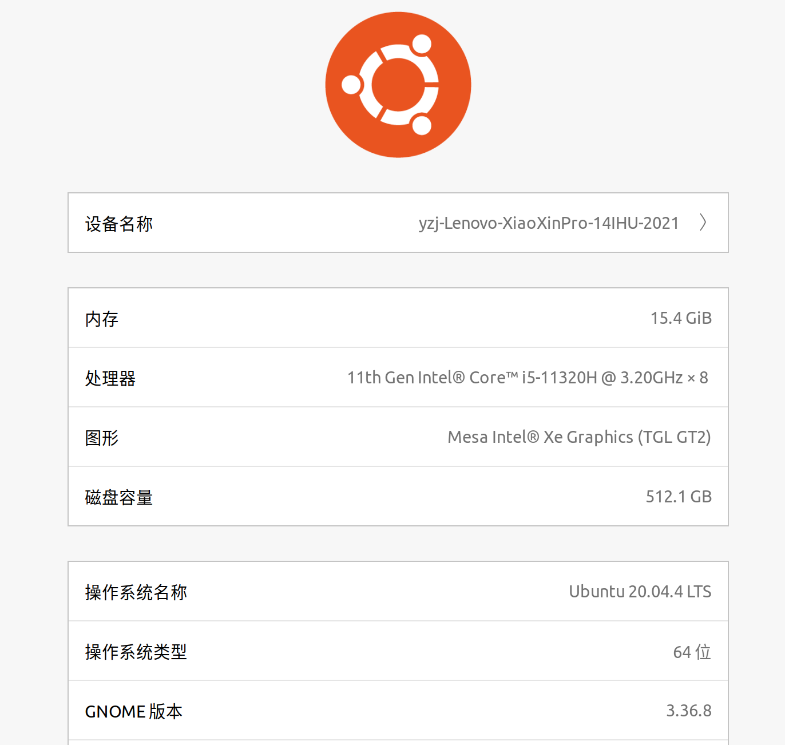
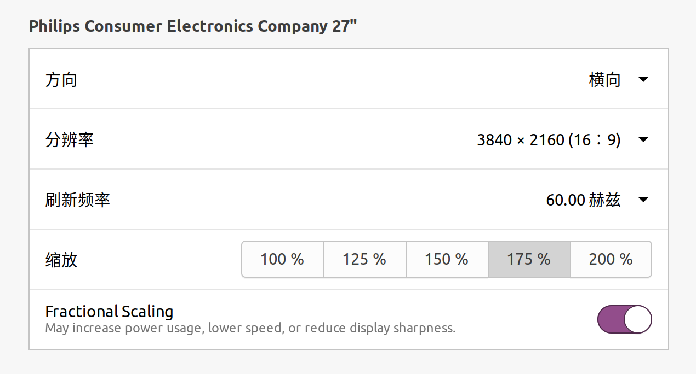

# learn-Apollo_6.0

对Apollo6.0的学习记录

## 1、环境配置

### 1.1、双系统

硬件条件：

- 笔记本电脑：小新 pro 14
  
  

- 显示器：飞利浦，三头供电，双向type-c口通信

软件条件：

- 已安装：windows 11 家庭版
- 待安装：ubuntu 20.04.4 LTS

系统安装就是正常流程，下载镜像、启动盘制作、磁盘分区、重启关secure boot、重启进boot loader安装、ubuntu grub引导设置；详细可以参见[这个链接](https://blog.csdn.net/qq_31347869/article/details/123357179)；

小新pro 14这个电脑不知道为什么，显卡or屏幕对ubuntu支持的不好，18.04和20.04都会闪屏；同时因为驱动问题，自带的触控板和键盘会失效；但实测连接外接显示器，然后把显示器设置调整为：



显示是正常的；过程适当参考[这个链接](https://blog.csdn.net/u012258905/article/details/121092545)。

### 1.2、Apollo6.0安装

总体上参考[这个教程](https://blog.csdn.net/weixin_45929038/article/details/120113008)和[这个博客](https://zhuanlan.zhihu.com/p/357006215)

- 踩坑1：
  
  装docker
  - 我在Ubuntu里安装了Teamviewer，刚开始安装docker的时候，dpkg总是报跟Teamviewer有关的错误；研究了一下报错内容，发现是在`sudo apt-get update`的时候，Teamviewer的官网连接不上；在“软件和更新”里，把Teamviewer的stabel repo取消掉，再执行更新，就可以了；
- 踩坑2：
  
  docker安装好后，Apollo的docker镜像拉取不下来；

  - 通过修改docker的配置文件实现，不需要重启docker服务（应该）
  
    ```bash
    ##使用阿里云镜像加速器
    [root@localhost ~]# mkdir -p /etc/docker
    [root@localhost ~]# tee /etc/docker/daemon.json <<-'EOF'
    {
      "registry-mirrors": ["https://9cpn8tt6.mirror.aliyuncs.com"]
    }
    EOF
    [root@localhost ~]# systemctl daemon-reload
    ```

  - 然后执行脚本的时候，添加参数，指定中国大陆的下载方式：

    ```bash
    sudo bash docker/scripts/dev_start.sh -g cn
    ```

- 踩坑3：
  
  我在磁盘分区的时候，根目录分配空间太小了，docker镜像拉取不下来；
  - 同样是通过修改配置文件，修改docker镜像的默认保存位置：

    ```json
    {
      "registry-mirrors": ["https://9cpn8tt6.mirror.aliyuncs.com"],
      "data-root":"/home/yzj/.dockerlib"
    }
    ```

  - 执行`sudo systemctl daemon-reload`，`sudo systemctl restart docker.service`重启服务；执行`sudo systemctl status docker -l`查看服务状态；执行`sudo docker info`查看配置信息；
  - 之后总算成功拉取apollo的docker镜像。
- 踩坑4：
  
  在apollo容器内部，执行编译时，获取远程repo有问题；

  - 考虑构建docker时，使用宿主机的proxy，同样是通过修改配置文件实现：

    ```json
    {
      "registry-mirrors": ["https://9cpn8tt6.mirror.aliyuncs.com"],
      "data-root":"/home/yzj/.dockerlib",
      "proxies":
      {
        "default":
        {
          "httpProxy": "127.0.0.1:7890",
          "httpsProxy": "127.0.0.1:7890",
          "noProxy": "localhost"
        }
      }
    }
    ```

    修改后执行reload。

进入操作：（在apollo源码根目录下执行）参见[这个链接](https://zhuanlan.zhihu.com/p/363883431)

- 从本地镜像构建apollo容器：
  
  ```bash
  img=$(sudo docker images | grep dev)
  name=($img)
  sudo bash docker/scripts/dev_start.sh -l -t ${name[1]}
  ```

  初次拉取镜像不需要上述操作；
- 进入apollo容器：

  ```bash
  sudo bash docker/scripts/dev_into.sh
  ```

- 在apollo容器内部编译：
  
  ```bash
  bash apollo.sh clean -a
  bash apollo.sh build_cpu
  ```

停止操作：（仍然是在源码根目录执行）

- `ctrl+d`退出docker；
- 在Docker外，执行

  ```bash
  sudo bash docker/scripts/dev_start.sh stop
  ```
